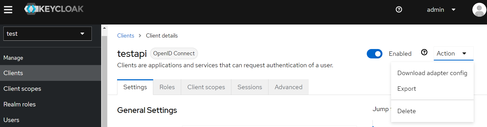

# Quick.Keycloack.client

[](https://github.com/PhilippeTOURNIE/Quick.Swagger)
[](https://conventionalcommits.org)
[](https://github.com/PhilippeTOURNIE/Quick.Swagger/blob/main/LICENSE.md)

Quick start for client rest api using Keycloack.

Package                                | Version                                                                                                                                  | Description
---------------------------------------|------------------------------------------------------------------------------------------------------------------------------------------|--------------------------------------------------------------------------
`Quick.Keycloack.client`         | 1.0


# Install and configure a server keycloak on docker

```powershell
docker run  -p 8082:8080 -e KEYCLOAK_ADMIN=admin -e KEYCLOAK_ADMIN_PASSWORD=admin  quay.io/keycloak/keycloak start-dev
```

- create a realm "Test"
- create a user test

  
- set user password
  
  
- create a client testapi width url http://localhost:5130  (Quick.Keycloack.Sample launching settings)
 
 
- config client 
 
 
 
 Replace  url https://localhost:7217 by  http://localhost:5130  in this screen view  sample
- Create realm role "RealAdmin"


- map user role "RealAdmin"


<i>nota: for this example api rest is only on http (not https) </i>


## Getting Started
 - Add "builder.AddKeycloakTokenJWT();" in your program.cs

```csharp
// Program.cs
using Quick.Keycloak.Client;

var builder = WebApplication.CreateBuilder(args);

// Add services to the container.
builder.Services.AddAuthorization(options =>
{
    options.AddPolicy("admin", policy => policy.RequireClaim(ClaimTypes.Role, "RealAdmin"));
});
builder.Services.AddControllers();

builder.AddQuickKeycloakTokenJWT();

var app = builder.Build();

// Configure the HTTP request pipeline.

app.UseHttpsRedirection();

app.UseAuthentication();

app.UseAuthorization();


app.MapControllers();

app.Run();
```

- Modify file appsettings.json and add a new section  adaptor configs of your client keycloak
 
 in Keycloack export adapter
 

and fill appsettings.json like below

```json
 "KeycloackAdatpter": {
    "realm": "test",
    "auth-server-url": "http://localhost:8080/",
    "ssl-required": "external",
    "resource": "testapi",
    "public-client": true,
    "confidential-port": 0  
  }
    
```

- secure controller with Authorize attribute
  ```csharp
  [Authorize(AuthenticationSchemes = JwtBearerDefaults.AuthenticationScheme,Policy = "admin") ]
    [ApiController]
    [Route("[controller]")]
    public class WeatherForecastController : ControllerBase
    {
  ```

## Custom Method AddQuickKeycloakTokenJWT

you can transform your claim as you want using ```Action<ClaimsIdentity> transformClaim```

  ```csharp
 public static void AddQuickKeycloakTokenJWT(this WebApplicationBuilder builder, Action<ClaimsIdentity> transformClaim =null)
 public static void AddQuickKeycloakTokenJWT(this WebApplicationBuilder builder, KeyCloackAdapterOption keyCloackAdapterOption, Action<ClaimsIdentity> transformClaim = null)
```

parameter "Action<ClaimsIdentity>"  can be use to transform principal claimidentity to your custom role

like this for example :
  ```csharp
builder.AddQuickKeycloakTokenJWT(claim =>
{
    var userRoleRealm = claim.FindFirst((claim) => claim.Type == "realm_access");
    if (userRoleRealm != null)
    {
        var realmAccess = JsonConvert.DeserializeObject<RealmAccess>(userRoleRealm.Value);

        if (realmAccess != null)
            foreach (var role in realmAccess.roles)
            {
                claim.AddClaim(new Claim(ClaimTypes.Role, role));
            }
    }
});
```

## Sample

See project ApiDemo

- With Postman get user token


- swagger get weather endpoint 


## Build and Development

`dotnet build --configuration release ./Quick.Keycloack.client.csproj`

`dotnet pack -o ./Artefacts ./Quick.Keycloack.client.csproj`

## Special thanks to the [blog of Xavier Hahn](https://medium.com/@xavier.hahn/asp-net-core-angular-openid-connect-using-keycloak-6437948c008)


